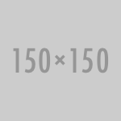

<!DOCTYPE html>
<html>
<head>
    <meta charset="utf-8">
    <meta name="viewport" content="width=device-width, initial-scale=1, maximum-scale=1, user-scalable=no" />
    <title>全局样式</title>
    <meta name="module-info" content="">
    <meta name="author" content="xuld@vip.qq.com">
    <meta name="description" content="定义全局 CSS 样式。">
    
    <link rel="stylesheet" type="text/css" href="../../typography/core/reset.css" />
</head>
<body>

    <h2 data-doc="typography/core/reset.css">标签重置 <small>(CSS Reset)</small></h2>
    
重置标签，统一浏览器默认行为，避免一些兼容性问题。

    <ul>
        <li>禁用移动端自动缩放文字功能。</li>
        <li>禁用 IOS 触摸阴影效果。</li>
        <li>统一 HTML5 标签显示效果。</li>
        <li>统一内联块级标签和 <code>&lt;sub&gt;</code>、<code>&lt;sup&gt;</code> 垂直对齐方式。</li>
        <li>删除 <code>&lt;img&gt;</code> 默认边框。</li>
        <li>统一表单标签默认样式。</li>
    </ul>

    <blockquote>为精简代码，TealUI 并未重置所有标签。另参考：<a href="https://github.com/necolas/normalize.css" target="_blank">normalize.css</a></blockquote>

    <h2 data-doc="typography/core/reset.css">默认样式</h2>

    <h3>字体</h3>
    
为使中文排版更加美观，TealUI 默认使用了 14px 大号字体。

    <pre>
        body {
            margin: 0;
            font-family: "Helvetica Neue", Helvetica, "Microsoft Yahei", "Hiragino Sans GB", "WenQuanYi Micro Hei", sans-serif;;
            font-size: 14px;
            line-height: 171.42857143%; /* 24px */
        }
    </pre>

    <h4>Chrome 小号字体问题</h4>
    
如果希望在 Chrome 显示小于 12px 的字号，可以使用 em 或 rem 单位的字号。或者使用 <code>transform</code> 缩放。

    <aside class="doc-demo">
        手机 Chrome 可以显示很小，电脑 Chrome 无效。
    </aside>

    <blockquote>另参考：<a href="https://offroadcode.com/prototypes/rem-calculator/" target="_blank">REM 单位转换器</a></blockquote>

    <h3>边距</h3>
    
TealUI 为语义化块级标签定义 1em(同字体大小, 14px) 的下边距：

    <pre>
        p, hr, table, ul, ol, dl, blockquote, pre, address, fieldset {
            margin: 0 0 1em;
        }
    </pre>

    <h3>链接</h3>
    <aside class="doc-demo">
        我是文本 <a href="###">我是链接</a> <a>我是描点</a>
    </aside>

    <h3>标题</h3>
    <aside class="doc-demo">
        <h1>标题1（Heading 1）：标题可以很长很长很长很长很长很长很长很长很长很长很长很长很长很长 <small>副标题（Subheading）</small></h1>
        <h2>标题2（Heading 2）：标题可以很长很长很长很长很长很长很长很长很长很长很长很长很长很长 <small>副标题（Subheading）</small></h2>
        <h3>标题3（Heading 3）：标题可以很长很长很长很长很长很长很长很长很长很长很长很长很长很长 <small>副标题（Subheading）</small></h3>
        <h4>标题4（Heading 4）：标题可以很长很长很长很长很长很长很长很长很长很长很长很长很长很长 <small>副标题（Subheading）</small></h4>
        <h5>标题5（Heading 5）：标题可以很长很长很长很长很长很长很长很长很长很长很长很长很长很长 <small>副标题（Subheading）</small></h5>
        <h6>标题6（Heading 6）：标题可以很长很长很长很长很长很长很长很长很长很长很长很长很长很长 <small>副标题（Subheading）</small></h6>
    </aside>

    <h3>段落</h3>
    
    <aside class="doc-demo" id="article">
        <h2>雪</h2>
        
美丽的雪花飞舞起来了。我已经有三年不曾见着它。

        
去年在福建，仿佛比现在更迟一点，也曾见过雪。但那是远处山顶的积雪，可不是飞舞的雪花。在平原上，它只是偶然的随着雨点洒下来几颗，没有落到地面的时候。它的颜色是灰的，不是白色；它的重量像是雨点，并不会飞舞。一到地面，它立刻融成了水，没有痕迹，也未尝跳跃，也未尝发出唏嘘的声音，像江浙一带下雪时的模样。这样的雪，在四十年来第一次看见它的老年的福建人，诚然能感到特别的意味，谈得津津有味，但在我，却总觉得索然。"福建下过雪"，我可没有这样想过。

        
我喜欢眼前飞舞着的上海的雪花。它才是"雪白"的白色，也才是花一样的美丽。它好像比空气还轻，并不从半空里落下来，而是被空气从地面卷起来的。然而它又像是活的生物，像夏天黄昏时候的成群的蚊蚋(ruì)，像春天酿蜜时期的蜜蜂，它的忙碌的飞翔，或上或下，或快或慢，或粘着人身，或拥入窗隙，仿佛自有它自己的意志和目的。它静默无声。但在它飞舞的时候，我们似乎听见了千百万人马的呼号和脚步声，大海汹涌的波涛声，森林的狂吼声，有时又似乎听见了儿女的窃窃私语声，礼拜堂的平静的晚祷声，花园里的欢乐的鸟歌声……它所带来的是阴沉与严寒。但在它的飞舞的姿态中，我们看见了慈善的母亲，活泼的孩子，微笑的花儿，和暖的太阳，静默的晚霞……它没有气息。但当它扑到我们面上的时候，我们似乎闻到了旷野间鲜洁的空气的气息，山谷中幽雅的兰花的气息，花园里浓郁的玫瑰的气息，清淡的茉莉花的气息……在白天，它做出千百种婀娜的姿态；夜间，它发出银色的光辉，照耀着我们行路的人，又在我们的玻璃窗上扎扎地绘就了各式各样的花卉和树木，斜的，直的，弯的，倒的。还有那河流，那天上的云…

    </aside>

    <h3>列表</h3>
    <aside class="doc-demo">
        <ul>
            <li>列表1</li>
            <li>
                列表 2
                <ul>
                    <li>列表 2.1</li>
                    <li>列表 2.2</li>
                </ul>
            </li>
        </ul>
    </aside>
    <aside class="doc-demo">
        <ol>
            <li>列表1</li>
            <li>列表 2</li>
        </ol>
    </aside>
    <aside class="doc-demo">
        <dl>
            <dt>列表1</dt>
            <dd>列表 2</dd>
            <dt>列表1</dt>
            <dd>列表 2</dd>
        </dl>
    </aside>
    <blockquote>更多列表样式请参考 <a href="../misc/list.html">列表(list)</a> 组件。</blockquote>

    <h3>表格</h3>
    <aside class="doc-demo">
        <table>
            <tr>
                <th>表格 1-1</th>
                <th>表格 1-2</th>
            </tr>
            <tr>
                <td>表格 2-1</td>
                <td>表格 2-2</td>
            </tr>
            <tr>
                <td>表格 3-1</td>
                <td>表格 3-2</td>
            </tr>
        </table>
    </aside>

    <blockquote>更多表格样式请参考 <a href="../misc/table.html">表格(table)</a> 组件。</blockquote>

    <h3>水平线</h3>
    <aside class="doc-demo">
        

    </aside>
    <blockquote class="doc-info">更多水平线样式请参考 <a href="../misc/line.html">水平线(line)</a> 组件。</blockquote>

    <h3>图片</h3>
    <aside class="doc-demo">
        
        
        
    </aside>
    <aside class="doc-demo">
        <figure>
            我是图表
        </figure>
    </aside>
    <blockquote>更多图片样式请参考 <a href="../misc/article.html">文章(article)</a> 组件、<a href="../misc/thumbnail.html">缩略图(thumbnail)</a> 组件、<a href="../misc/videoPlaceholder.html">视频缩略图(videoPlaceholder)</a> 组件和 <a href="../misc/userFace.html">头像(userFace)</a> 组件。</blockquote>

    <h3>代码</h3>
    <aside class="doc-demo">
        文字
        <code>Code</code>
        <kbd>Ctrl+,</kbd>
        <var>x</var>
        <samp>Done</samp>
    </aside>
    <aside class="doc-demo">
        <pre>var x = 1;
var y = 2;
function fn(){
    return 4;
}
</pre>
    </aside>

    <h3>杂项</h3>
    <aside class="doc-demo">
        文字
        <small>小字</small>
        <abbr title="我是说明">说明</abbr>
        <mark>标记</mark>
        <dfn>术语</dfn>
        <cite>引用</cite>
        <address>地址</address>
    </aside>

    <h2>标签一览</h2>

    <h3>HTML5 新标签</h3>
    
TealUI 重置了 HTML5 新标签，以保证这些标签在低版本浏览器可以正常显示。

    <pre>
        article, aside, section, header, footer, nav, menu, figcaption, figure, main, details, summary {
            display: block;
        }
        [hidden], template, audio:not([controls]) {
            display: none;
        }
    </pre>
    <aside class="doc-demo">
        <input type="search" />
        <input type="number" />
        <input type="range" />
        <progress value="0.8"></progress>
    </aside>
    <aside class="doc-demo">
        <aside>aside</aside>
        

            
点我展开

            
我是被展开的内容

        

        <template>
            template 不应该被显示
        </template>
    </aside>
    <aside class="doc-demo">
        <audio>audio</audio>
        <audio controls="controls" src="../../../assets/resources/horse.ogg">audio</audio>
        <video controls="controls" src="../../../assets/resources/horse.ogg">video</video>
    </aside>

    <h3>表单</h3>
    
TealUI 提供了专门的表单组件，全局样式只负责修复表单默认样式。

    <pre>
        input, button, select, textarea, optgroup {
            font: inherit;
        }
        input[type=checkbox], input[type=radio] {
            margin-top: 1px;
            vertical-align: -2px;
        }
        textarea {
            overflow: auto;
            vertical-align: top;
        }
    </pre>
    <aside class="doc-demo">
        <input type="radio" />
        <input type="checkbox" />
        <label>文本</label>:
        <input type="text" placeholder="文本框" />
        <select>
            <optgroup label="选择组">
                <option>选择框1</option>
                <option>选择框2</option>
            </optgroup>
            <option>选择框1</option>
            <option>选择框2</option>
        </select>
        <input type="button" value="按钮1" />
        <button>按钮2</button>
    </aside>
    <aside class="doc-demo">
        <textarea>文本域</textarea>
    </aside>
    <aside class="doc-demo">
        <fieldset>
            <legend>标签</legend>
            文字
        </fieldset>
    </aside>
    <blockquote>更多表单样式请参考 <a href="../form/form.html">表单(form)</a> 组件。</blockquote>

    <h3>其它块级标签</h3>
    <aside class="doc-demo">
        <address>address</address>
        <blockquote>blockquote</blockquote>
    </aside>
    <blockquote>用于表示名言引入的块级引用请参考 <a href="../misc/blockquote.html">块级引用(blockquote)</a> 组件。</blockquote>

    <h3>其它内联标签</h3>
    <aside class="doc-demo">
        文本：
        <code>code</code>
        <strong>strong</strong>
        <em>em</em>
        <big>big</big>
        <small>small</small>
        sup
        sub
        <del>del</del>
        <cite>cite</cite>
        <abbr title="我是说明">abbr</abbr>
        <dfn>dfn</dfn>
        <u>u</u>
        <i>i</i>
        <b>b</b>
        <q>q</q>
        <ins>ins</ins>
        <mark>mark</mark>
    </aside>
</body>
</html>
